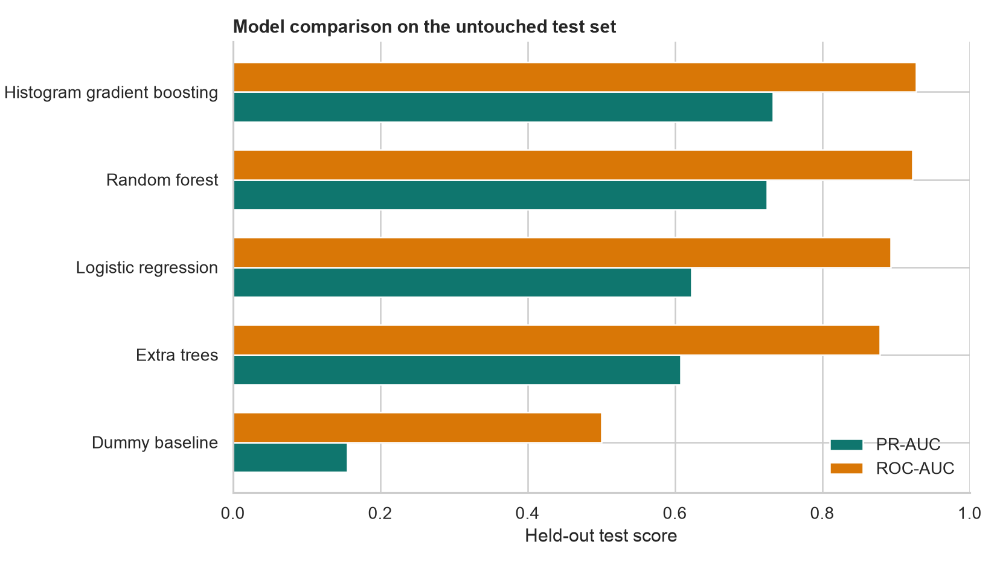
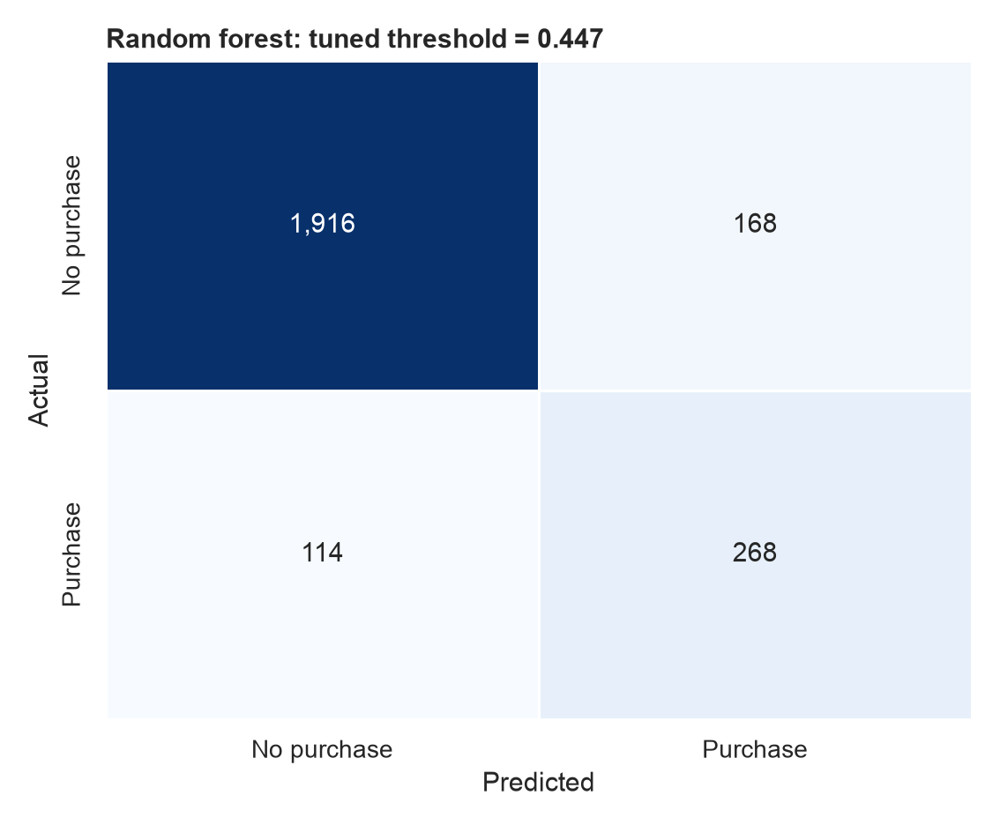
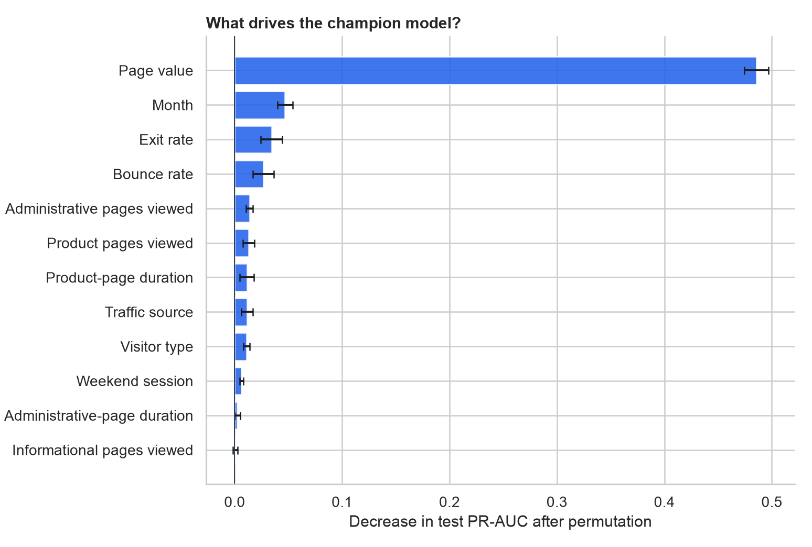
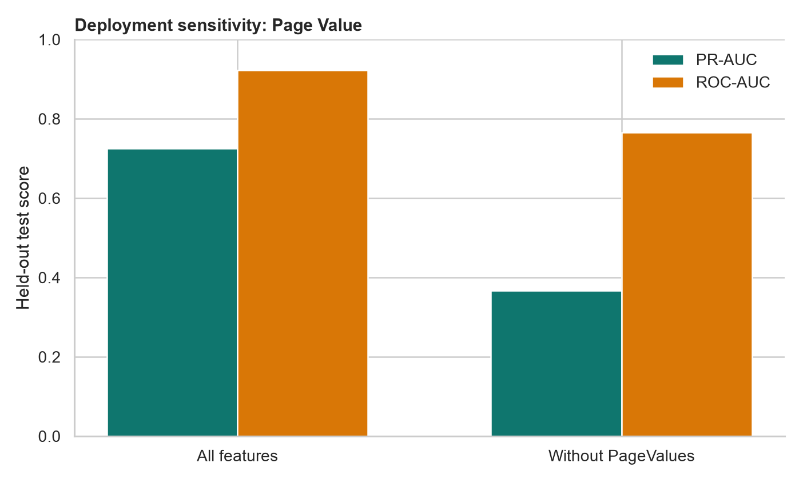

# Online Shopper Purchase Intention

[](python_analysis/)
[](stat301_code.ipynb)
[](python_analysis/train_models.py)
[](python_analysis/results/)

A two-part data science project that studies and predicts whether an online
shopping session will result in a purchase. The original STAT 301 analysis uses
R for statistical inference; the Python extension compares machine-learning
models, tunes an operating threshold, and translates performance into practical
e-commerce decisions.

## Project at a Glance

| Item | Result |
|---|---:|
| Shopping sessions | **12,330** |
| Purchase sessions | **1,908 (15.5%)** |
| Candidate models | **5** |
| Selected model | **Random Forest** |
| Held-out PR-AUC | **0.725** |
| Held-out ROC-AUC | **0.922** |
| Recall at tuned threshold | **70.2%** |

> A naive model is already 84.5% accurate by predicting no purchase every time.
> For that reason, this project selects models with PR-AUC rather than accuracy.

## Two Analytical Tracks

| Track | Purpose | Deliverable |
|---|---|---|
| R statistical analysis | Explain associations between purchase probability, session timing, and browsing behavior | [Open the original notebook](stat301_code.ipynb) |
| Python machine learning | Compare predictive models, evaluate an untouched test set, explain drivers, and assess deployment risk | [Read the model report](python_analysis/MODEL_REPORT.md) |

## Model Comparison

Five models were evaluated with stratified five-fold cross-validation on the
development sample. Random Forest had the highest mean validation PR-AUC and was
selected before the test set was evaluated.



| Model | CV PR-AUC | Test PR-AUC | Test ROC-AUC |
|---|---:|---:|---:|
| Random Forest | **0.744** | 0.725 | 0.922 |
| Histogram Gradient Boosting | 0.737 | **0.733** | **0.928** |
| Logistic Regression | 0.657 | 0.622 | 0.893 |
| Extra Trees | 0.621 | 0.608 | 0.878 |
| Dummy Baseline | 0.155 | 0.155 | 0.500 |

Histogram Gradient Boosting scored slightly higher on this particular test
sample, but Random Forest remains the selected model because the choice was made
using cross-validation rather than test-set performance.

## Decision Threshold

The standard 0.50 cutoff identified 65.4% of purchasers. A threshold of
**0.447**, selected from out-of-fold development predictions, increased test
recall to **70.2%** with **61.5% precision**.



In practice, the threshold should follow campaign economics:

- Favor recall when missing a likely buyer is expensive.
- Favor precision when outreach, discounts, or sales attention are costly.
- Keep probability scores when teams need ranked audiences rather than a hard
  yes/no decision.

## What Drives Predictions?

Permutation importance measures the decrease in held-out PR-AUC after each
original feature is shuffled.



The strongest signals are Page Value, month, exit rate, bounce rate, and the
amount of product and administrative browsing. These are predictive
relationships, not proof that changing any one feature will cause a purchase.

## Production Reality Check

`PageValues` dominates the model, but it may not be available at the moment a
live prediction is needed. A sensitivity model was therefore trained without
that field.

| Feature set | CV PR-AUC | Test PR-AUC | Test ROC-AUC |
|---|---:|---:|---:|
| All features | 0.744 | **0.725** | **0.922** |
| Without PageValues | 0.385 | **0.367** | **0.765** |



The large performance drop does not automatically prove leakage. It does mean
that the definition, timing, and production availability of `PageValues` must
be confirmed before deployment.

## Reproducible Workflow

The Python pipeline:

1. Loads and validates the 12,330-session dataset.
2. Treats integer-coded browser, region, traffic, and operating-system fields as
   categories.
3. Fits preprocessing inside each cross-validation fold to avoid leakage.
4. Compares a baseline, Logistic Regression, Random Forest, Extra Trees, and
   Histogram Gradient Boosting.
5. Selects the model by five-fold validation PR-AUC.
6. Tunes the classification threshold using out-of-fold predictions.
7. Evaluates once on a stratified 20% holdout set.
8. Generates metrics, figures, permutation importance, and a written report.

Run it from the repository root:

```bash
python3 -m venv .venv
source .venv/bin/activate
pip install -r python_analysis/requirements.txt
python python_analysis/train_models.py
```

All random operations use seed `42`.

Run the lightweight regression tests:

```bash
.venv/bin/python -m unittest discover -s python_analysis -p "test_*.py"
```

## Repository Structure

```text
.
|-- data/
|   |-- online_shoppers_intention.csv
|   `-- project stage 1 (1).ipynb
|-- python_analysis/
|   |-- figures/
|   |-- results/
|   |-- MODEL_REPORT.md
|   |-- README.md
|   |-- requirements.txt
|   |-- test_train_models.py
|   `-- train_models.py
|-- stat301_code.ipynb
`-- README.md
```

## Data Source

Sakar, C. O., and Kastro, Y. (2018). *Online Shoppers Purchasing Intention
Dataset*. UCI Machine Learning Repository.
[https://doi.org/10.24432/C5F88Q](https://doi.org/10.24432/C5F88Q)

Each row represents a different user session within a one-year period. The
target `Revenue` indicates whether the session ended in a transaction.

## Limitations

- A random holdout estimates performance on the same historical distribution,
  not on future traffic.
- The dataset does not include campaign cost or customer lifetime value.
- Threshold selection optimizes F1, which may not match a specific business
  cost function.
- Model importance is predictive rather than causal.

## Credits

The original STAT 301 final project was completed by Group 23:

- Sarah Chan
- Zewen Jin
- Bryan Sun

The Python machine-learning extension adds reproducible model comparison,
test-set evaluation, threshold analysis, explainability, and deployment-focused
interpretation.
