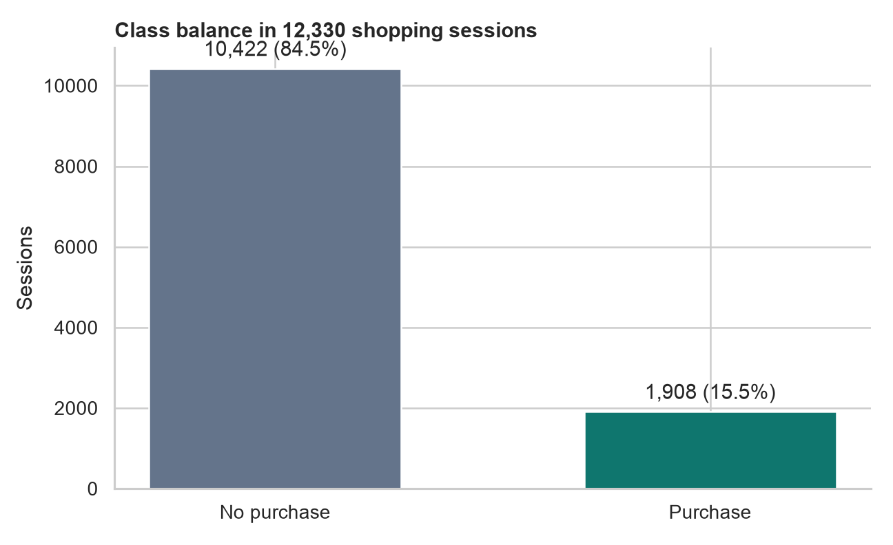
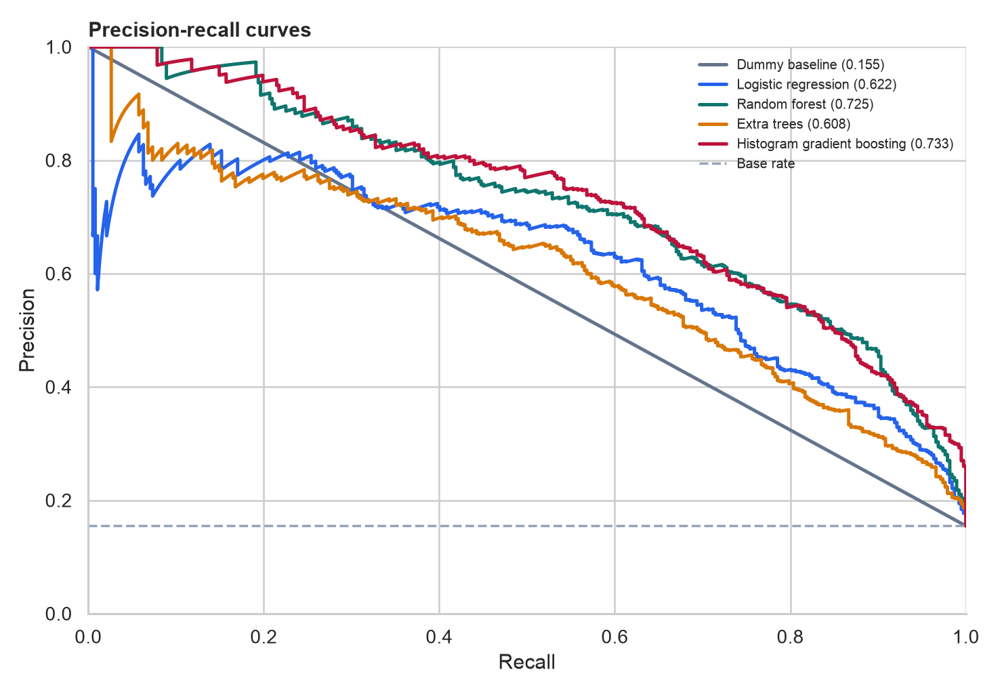

# Online Shopper Purchase Prediction

## Executive Summary

This project compared five classification approaches on **12,330 online
shopping sessions**. Only **1,908 sessions (15.5%)** ended in a
purchase, so PR-AUC was used as the main model-selection metric rather than raw
accuracy.

**Random forest** achieved the strongest cross-validated PR-AUC and was selected
before the final test evaluation. On the untouched test set it reached
**0.725 PR-AUC** and **0.922 ROC-AUC**.

At the tuned threshold of **0.447**, the model identified
**70.2% of purchasing sessions** with **61.5%
precision**. This is a business trade-off: a lower threshold catches more likely
buyers but also sends more non-buyers into a campaign or sales workflow.


## Why Accuracy Is Not Enough

A model that predicts "no purchase" for every session is already
84.5% accurate because purchases are uncommon. The dummy baseline
makes that limitation visible. PR-AUC focuses evaluation on how well a model
finds the minority purchase class.



## Model Selection

Five-fold stratified cross-validation was performed only on the development
sample. The test sample remained untouched until the model and tuning approach
had been chosen.

| Model | CV PR-AUC | CV ROC-AUC | CV F1 |
|---|---:|---:|---:|
| Random forest | 0.744 | 0.930 | 0.682 |
| Histogram gradient boosting | 0.737 | 0.929 | 0.670 |
| Logistic regression | 0.657 | 0.904 | 0.617 |
| Extra trees | 0.621 | 0.888 | 0.586 |
| Dummy baseline | 0.155 | 0.500 | 0.000 |

## Held-Out Test Results

The table below uses the standard 0.50 probability threshold so the models are
directly comparable.

| Model | PR-AUC | ROC-AUC | Precision | Recall | F1 |
|---|---:|---:|---:|---:|---:|
| Histogram gradient boosting | 0.733 | 0.928 | 0.573 | 0.770 | 0.657 |
| Random forest | 0.725 | 0.922 | 0.670 | 0.654 | 0.662 |
| Logistic regression | 0.622 | 0.893 | 0.491 | 0.743 | 0.591 |
| Extra trees | 0.608 | 0.878 | 0.554 | 0.634 | 0.591 |
| Dummy baseline | 0.155 | 0.500 | 0.000 | 0.000 | 0.000 |



## Operating Point for the Champion

The final threshold was selected from out-of-fold development predictions to
maximize F1, not from the test set.

| Metric | Default 0.50 | Tuned 0.447 |
|---|---:|---:|
| Precision | 0.670 | 0.615 |
| Recall | 0.654 | 0.702 |
| F1 | 0.662 | 0.655 |
| Balanced accuracy | 0.798 | 0.810 |


## Model Drivers

Model-agnostic permutation importance measures how much held-out PR-AUC falls
when each original feature is randomly shuffled.

| Feature | Mean PR-AUC decrease |
|---|---:|
| Page value | 0.4855 |
| Month | 0.0469 |
| Exit rate | 0.0344 |
| Bounce rate | 0.0266 |
| Administrative pages viewed | 0.0138 |
| Product pages viewed | 0.0131 |
| Product-page duration | 0.0114 |
| Traffic source | 0.0114 |

The leading signals were **Page value, Month, Exit rate, Bounce rate, Administrative pages viewed, Product pages viewed**. Importance shows what the
model relies on for prediction; it does not prove that changing a feature will
cause a purchase.


## Deployment Sensitivity: Page Value

`PageValues` dominates predictive performance, but it may not be available at
the exact moment a live decision must be made. The champion model was therefore
retrained and evaluated without it.

| Feature set | CV PR-AUC | Test PR-AUC | Test ROC-AUC |
|---|---:|---:|---:|
| All features | 0.744 | 0.725 | 0.922 |
| Without PageValues | 0.385 | 0.367 | 0.765 |

Removing the field reduced held-out PR-AUC by **0.358**. This does
not prove leakage, but it makes feature availability and calculation timing the
first production-readiness question.


## Practical Interpretation

1. Use the score to prioritize sessions for interventions such as targeted
   offers, remarketing, or live assistance.
2. Set the decision threshold from campaign economics. When missing a buyer is
   expensive, favor recall; when outreach is costly, favor precision.
3. Treat Page Value carefully in production. Confirm that it is available at
   scoring time and is not calculated using information observed after purchase.
4. Monitor performance by month, visitor type, traffic source, and region before
   deployment because behavior and traffic mix can change.

## Limitations

- The random split estimates performance on sessions drawn from the same
  historical distribution; it is not a substitute for future-period validation.
- The dataset records session behavior, not customer lifetime value or campaign
  cost.
- Model importance is predictive rather than causal.
- Integer-coded fields such as browser, region, and traffic type were treated as
  categories rather than ordered quantities.

## Reproduce the Analysis

```bash
python3 -m venv .venv
source .venv/bin/activate
pip install -r python_analysis/requirements.txt
python python_analysis/train_models.py
```

Generated tables are stored in `python_analysis/results/`; generated charts
are stored in `python_analysis/figures/`.
